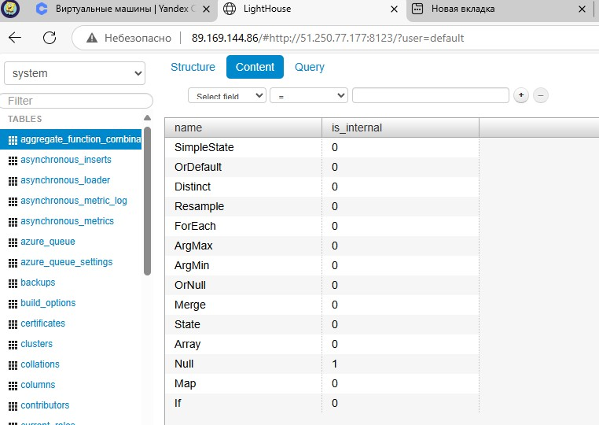

# Инфраструктура ClickHouse, Vector и Lighthouse

Этот проект через развертывание инфраструктуры (с помощью Terraform) в Yandex Cloud настраивает сервера для ClickHouse, Vector и Lighthouse с использованием Ansible.

## Terraform (`main.tf`)
- Разворачивает VPC сеть и подсеть в Yandex Cloud.
- Создает 3 прерываемые ВМ (`clickhouse`, `vector`, `lighthouse`) с публичными IP.
- Генерирует динамический инвентарь Ansible (`inventory/prod.yml`) с IP-адресами ВМ.

## Ansible Playbook (`playbook.yml`)
Playbook состоит из трех основных частей, каждая из которых настраивает соответствующую ВМ с использованием тегов для выборочного выполнения.

### 1. Развертывание ClickHouse (`clickhouse_node`)
Настройка сервера ClickHouse для хранения и обработки логов. Выполняется с тегом `clickhouse`.
- **Добавление репозитория**:
  - Добавляется ключ репозитория с `keyserver.ubuntu.com` (ID: `3E4AD4719DDE9A38`).
  - Подключается репозиторий `deb https://packages.clickhouse.com/deb stable main`.
  - Обновляется кэш пакетов (`apt update`).
- **Установка пакетов**:
  - Устанавливаются `clickhouse-server` и `clickhouse-client`.
- **Конфигурация**:
  - В файл `/etc/clickhouse-server/config.xml` добавляется блок `<listen_host>0.0.0.0</listen_host>` для прослушивания всех интерфейсов.
  - Устанавливаются права доступа `0400` с владельцем `clickhouse` и группой `clickhouse`.
- **Запуск сервиса**:
  - Служба `clickhouse-server` запускается и добавляется в автозагрузку.
- **Создание базы данных и таблицы**:
  - Создается база данных `logs`, если она еще не существует (команда: `CREATE DATABASE IF NOT EXISTS logs`).
  - Создается таблица `logs.system_logs` с полями:
    - `timestamp DateTime` — время события.
    - `message String` — текст сообщения.
    - `level String` — уровень лога.
    - Используется движок `MergeTree` с сортировкой по `timestamp`.
- **Обработчик**:
  - `Restart ClickHouse` — перезапускает службу при изменении конфигурации.

### 2. Развертывание Vector (`vector_node`)
Установка и настройка Vector для обработки и передачи логов. Выполняется с тегом `vector`.
- **Скачивание и установка**:
  - Загружается .deb-пакет Vector указанной версии (`vector_{{ vector_version }}-1_amd64.deb`) с `https://apt.vector.dev`.
  - Устанавливается через `apt`.
- **Конфигурация**:
  - Создается директория `/etc/vector` с правами `0755`.
  - Разворачивается конфигурационный файл из шаблона `templates/vector.yml.j2` в `/etc/vector/vector.yml` с правами `0644`.
- **Запуск сервиса**:
  - Служба `vector` запускается и добавляется в автозагрузку.

### 3. Развертывание Lighthouse (`lighthouse_node`)
Настройка веб-интерфейса Lighthouse с Nginx для мониторинга. Выполняется с тегом `lighthouse`.
- **Установка зависимостей**:
  - Устанавливаются пакеты `nginx` и `git`, обновляется кэш `apt`.
- **Клонирование репозитория**:
  - Репозиторий `https://github.com/VKCOM/lighthouse.git` клонируется в `/var/www/lighthouse`, используется ветка `master`.
- **Конфигурация Nginx**:
  - Создается файл конфигурации из шаблона `templates/lighthouse-nginx.conf.j2` в `/etc/nginx/sites-available/lighthouse`.
  - Создается символическая ссылка в `/etc/nginx/sites-enabled/lighthouse`.
- **Запуск сервиса**:
  - Служба `nginx` запускается и добавляется в автозагрузку.
- **Обработчик**:
  - `Restart Nginx` — перезапускает Nginx при изменении конфигурации.

## Требования
- Установленные Terraform и Ansible.
- Доступ к Yandex Cloud: OAuth-токен, Cloud ID, Folder ID.
- SSH-ключ в `~/.ssh/id_ed25519.pub`.
- Шаблоны `vector.yml.j2` и `lighthouse-nginx.conf.j2` в папке `templates/`.

## Установка и запуск
1. Настройте переменные `yc_token`, `yc_cloud_id`, `yc_folder_id` в `terraform.tfvars`.
2. Выполните:
   ```bash
   terraform init && terraform apply
   ansible-playbook -i inventory/prod.yml playbook.yml
   ```

## Результаты работы
[log работы](logs_17-3.txt)  

  

