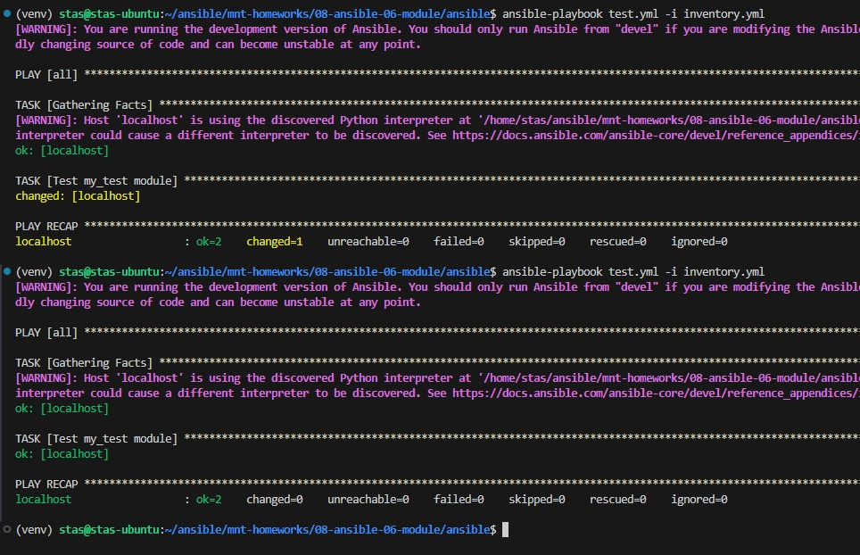
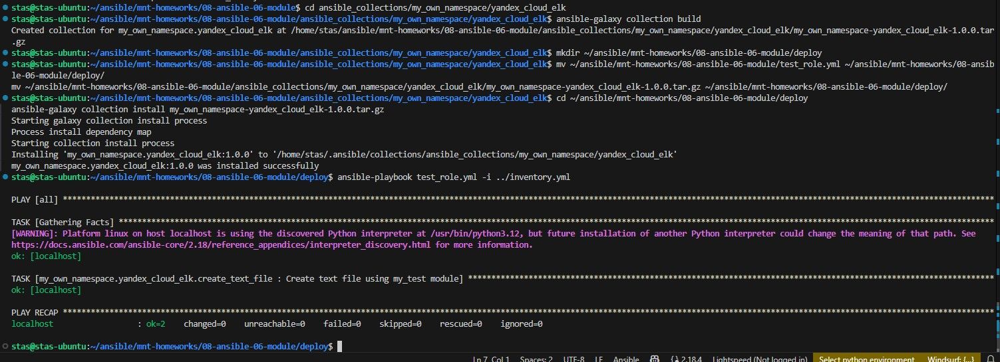

# Домашнее задание к занятию 6 «Создание собственных модулей»

## Решение

https://github.com/Stas-91/mnt-homeworks/blob/MNT-video/08-ansible-06-module/deploy/my_own_namespace-yandex_cloud_elk-1.0.0.tar.gz

https://github.com/Stas-91/mnt-homeworks/tree/MNT-video/08-ansible-06-module/ansible_collections/my_own_namespace/yandex_cloud_elk

